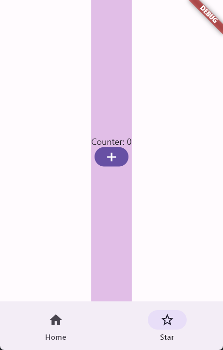
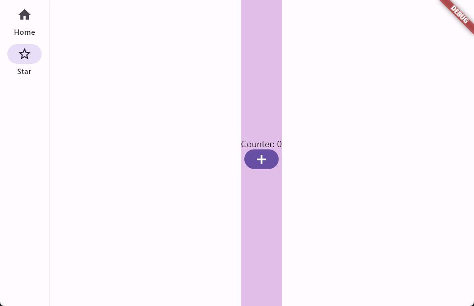

<!--
This README describes the package. If you publish this package to pub.dev,
this README's contents appear on the landing page for your package.

For information about how to write a good package README, see the guide for
[writing package pages](https://dart.dev/guides/libraries/writing-package-pages).

For general information about developing packages, see the Dart guide for
[creating packages](https://dart.dev/guides/libraries/create-library-packages)
and the Flutter guide for
[developing packages and plugins](https://flutter.dev/developing-packages).
-->

A Scaffold which is ability to automatically select between bottom and side
navigation as the screen size changes.

## Features

- Bottom Mode
  
  
  
- Side Mode

  

## Getting started

To use this plugin, add `auto_scaffold` as a [dependency in your pubspec.yaml file](https://flutter.dev/docs/development/platform-integration/platform-channels).

## Usage

Use AutoScaffold just like Scaffold. 

```dart
AutoScaffold(
    saveState: true,
    tabPages: [
        TabPage(
            label: "Home",
            icon: Icon(Icons.home),
            selectedIcon: Icon(Icons.home_outlined),
            widget: Home(key: ValueKey("Home")),
        ),
        TabPage(
            label: "Star",
            icon: Icon(Icons.star),
            selectedIcon: Icon(Icons.star_border),
            widget: Home(key: ValueKey("Star")),
        ),
    ],
);
```

## Additional information

Developer: Alfie

GitHub: [yi226](https://github.com/yi226)
